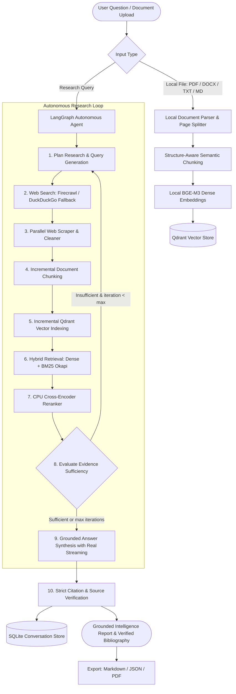

# Private Research Agent 🔬

[](https://www.python.org/downloads/)
[](https://github.com/langchain-ai/langgraph)
[](https://qdrant.tech/)
[](https://fastapi.tiangolo.com/)
[](https://react.dev/)
[](https://tailwindcss.com/)
[](LICENSE)

A modular, privacy-first **Autonomous Research Agent** that transforms complex natural-language research questions into fact-grounded, citation-backed intelligence reports with multi-turn conversation memory, hybrid retrieval (Dense BGE-M3 + Lexical BM25), cross-encoder reranking, and local document ingestion.

The system features an autonomous **LangGraph** self-reflection loop, real-time token streaming via Server-Sent Events (SSE), zero mandatory paid dependencies (with automatic DuckDuckGo and Ollama fallbacks), and multi-format report export (Markdown, JSON, PDF).

---

## 🏛️ Architecture Overview



---

## 🚀 Key Features

- **Autonomous Multi-Step LangGraph Agent**: Dynamically formulates research queries, assesses evidence completeness, and autonomously initiates follow-up search loops if context is insufficient.
- **Hybrid Retrieval (Dense + BM25)**: Fuses 1024-dimensional semantic search (`BAAI/bge-m3`) with in-memory lexical BM25 Okapi scoring to capture both semantic intent and exact technical terminology/acronyms.
- **CPU Cross-Encoder Reranker**: Employs a cross-attention transformer (`cross-encoder/ms-marco-MiniLM-L-6-v2` or FlashRank) to score `(query, passage)` pairs and eliminate low-relevance candidates before synthesis.
- **Multi-Source Web Search with Fallback**: Native Firecrawl integration paired with an automated DuckDuckGo fallback for seamless research even without external search API keys.
- **Local Document Ingestion**: Upload `.pdf` (with page-level provenance), `.docx`, `.txt`, and `.md` files directly through the UI or API to index into the Qdrant knowledge base.
- **Multi-Turn Conversation Memory**: Persistent SQLite storage (`data/conversations.db`) enables multi-turn follow-up research questions conditioned on session history.
- **Real Token Streaming**: Emits true low-latency Server-Sent Events (SSE) directly from LLM generation without artificial delays or token slicing.
- **Report Exporter**: Download comprehensive research intelligence reports formatted as Markdown (`.md`), structured JSON (`.json`), or portable PDF (`.pdf`).
- **Standardized Evaluation Suite**: Built-in benchmark harness measuring Context Precision, Context Recall, Faithfulness, Citation Accuracy, and Latency.
- **Modern React + Vite UI**: Sleek dark-mode interface featuring expandable thinking steps, citation badges, paperclip document upload, and export menus.

---

## 📂 Project Structure

```text
private-research-agent/
├── app/
│   ├── agent/                    # LangGraph autonomous research loop
│   │   ├── graph.py              # StateGraph definition & conditional routing
│   │   ├── nodes.py              # 9 workflow nodes with real streaming callbacks
│   │   ├── prompts.py            # Planner, evaluator, & synthesis prompts
│   │   ├── runner.py             # CLI runner for autonomous research
│   │   └── state.py              # TypedDict state with multi-turn history
│   ├── api/                      # Streaming FastAPI backend
│   │   ├── adapter.py            # SSE streaming adapter & SQLite persistence
│   │   └── server.py             # REST & SSE endpoints (upload, export, sessions)
│   ├── export/                   # Research report generator
│   │   └── exporter.py           # Markdown, JSON, and PDF report exporters
│   ├── ingestion/                # Document parsing, chunking & vectorization
│   │   ├── chunker.py            # Structure-aware markdown chunker
│   │   ├── doc_parser.py         # PDF, DOCX, TXT, MD parser & indexer
│   │   ├── embedder.py           # Local BGE-M3 embeddings (FastEmbed / ST)
│   │   └── qdrant_store.py       # Idempotent Qdrant vector operations
│   ├── processing/               # HTML sanitization & normalization
│   │   └── cleaner.py            # Canonical cleaner & metadata extractor
│   ├── retrieval/                # Advanced search & reranking
│   │   ├── hybrid.py             # BM25Okapi + Dense vector fusion
│   │   ├── reranker.py           # CPU Cross-Encoder / FlashRank reranker
│   │   └── search.py             # Lazy Qdrant client proxy & dense retrieval
│   ├── storage/                  # Multi-turn persistence
│   │   └── conversations.py      # SQLite conversation & message store
│   ├── web/                      # Web search & scraping
│   │   ├── scraper.py            # Parallel web scraper with backoff
│   │   ├── search.py             # Search coordinator with fallback
│   │   └── search_providers.py   # Firecrawl & DuckDuckGo providers
│   ├── config.py                 # Pydantic Settings & environment validation
│   └── main.py                   # Main CLI entrypoint
├── evaluation/                   # Quantitative benchmark harness
│   ├── dataset.json              # Curated research benchmark cases
│   ├── run_eval.py               # Evaluator measuring precision, recall, faithfulness
│   └── README.md                 # Evaluation methodology documentation
├── frontend/                     # Modern React 18 + Vite + TailwindCSS UI
│   ├── src/
│   │   ├── components/           # Chat, thinking process, upload, & export
│   │   ├── services/             # API client & SSE stream consumer
│   │   ├── types/                # TypeScript interfaces
│   │   └── App.tsx               # Main application component with session memory
│   ├── nginx.conf                # Production Nginx reverse proxy
│   └── package.json              # Frontend dependencies & scripts
├── tests/                        # Comprehensive unit & integration tests
│   ├── test_agent.py             # LangGraph state & node execution
│   ├── test_api.py               # Streaming adapter & API routes
│   ├── test_conversations.py     # SQLite persistence CRUD
│   ├── test_doc_parser.py        # PDF/DOCX/TXT parsing & chunking
│   ├── test_export.py            # Markdown, JSON, PDF exporters
│   ├── test_hybrid.py            # BM25 & dense retrieval fusion
│   ├── test_reranker.py          # Cross-encoder reranker logic
│   ├── test_web_scraper.py       # Parallel scraping & deduplication
│   └── test_web_search.py        # Search provider fallback
├── .env.example                  # Comprehensive environment template
├── .gitignore                    # Production git ignore configuration
├── docker-compose.yml            # Multi-container full-stack compose
├── Dockerfile.backend            # FastAPI backend container
├── Dockerfile.frontend           # React + Vite production build container
├── requirements.txt              # Pinned Python dependencies
└── README.md                     # Project documentation
```

---

## ⚡ Quickstart

### Option A: 1-Command Full-Stack Docker Launch (Recommended)

```bash
# 1. Clone repository
git clone <repository-url>
cd private-research-agent

# 2. Configure environment variables
cp .env.example .env
# Edit .env and supply your GROQ_API_KEY (or set LLM_PROVIDER=ollama for offline use)

# 3. Launch Qdrant, Backend, and Frontend containers
docker compose up --build
```

Access the services:
- **Web UI:** [http://localhost:3000](http://localhost:3000)
- **FastAPI Documentation:** [http://localhost:8000/docs](http://localhost:8000/docs)
- **Qdrant Dashboard:** [http://localhost:6333/dashboard](http://localhost:6333/dashboard)

---

### Option B: Local Development Setup

#### 1. Backend Setup

```bash
# Create and activate virtual environment
python -m venv .venv

# On Windows:
.venv\Scripts\activate
# On Linux / macOS:
source .venv/bin/activate

# Install Python dependencies
pip install -r requirements.txt

# Start Qdrant vector database via Docker
docker compose up -d qdrant

# Run FastAPI backend with live reloading
uvicorn app.api.server:app --host 0.0.0.0 --port 8000 --reload
```

#### 2. Frontend Setup

```bash
cd frontend
npm install
npm run dev
```

Open [http://localhost:5173](http://localhost:5173) in your browser.

---

## ⚙️ Configuration Reference (`.env`)

| Variable | Default | Description |
| :--- | :--- | :--- |
| `LLM_PROVIDER` | `groq` | Inference backend: `groq` (cloud speed) or `ollama` (100% offline). |
| `GROQ_API_KEY` | `""` | API key from [console.groq.com](https://console.groq.com) (free tier available). |
| `GROQ_MODEL` | `llama-3.3-70b-versatile` | Groq model for planning, evaluation, and synthesis. |
| `OLLAMA_BASE_URL` | `http://localhost:11434` | Ollama service endpoint for offline inference. |
| `OLLAMA_MODEL` | `qwen2.5:3b` | Local Ollama model. |
| `SEARCH_PROVIDER` | `firecrawl` | Primary search provider: `firecrawl` or `duckduckgo`. |
| `FALLBACK_SEARCH_PROVIDER` | `duckduckgo` | Zero-key search fallback when primary provider is unavailable. |
| `FIRECRAWL_API_KEY` | `""` | Optional API key from [firecrawl.dev](https://firecrawl.dev). |
| `QDRANT_HOST` | `localhost` | Qdrant host address. |
| `QDRANT_PORT` | `6333` | Qdrant HTTP port. |
| `QDRANT_COLLECTION` | `research_documents` | Target vector collection name. |
| `EMBEDDING_MODEL` | `BAAI/bge-m3` | 1024-dim local embedding model. |
| `DENSE_WEIGHT` | `0.7` | Weight of dense semantic vector score in hybrid retrieval. |
| `SPARSE_WEIGHT` | `0.3` | Weight of lexical BM25 Okapi score in hybrid retrieval. |
| `RERANKER_ENABLED` | `true` | Enable/disable CPU cross-encoder reranker. |
| `RERANKER_MODEL` | `ms-marco-MiniLM-L-6-v2` | Cross-encoder model name. |
| `RELEVANCE_THRESHOLD` | `0.35` | Minimum relevance score to consider evidence sufficient. |
| `MAX_RESEARCH_ITERATIONS`| `3` | Maximum autonomous search reflection loops. |
| `SQLITE_DB_PATH` | `data/conversations.db` | Local SQLite database file for multi-turn chat history. |

---

## 📡 API Reference

### Research & Streaming
| Endpoint | Method | Description |
| :--- | :--- | :--- |
| `/api/research/stream` | `POST` | Execute autonomous research and stream SSE events (`status`, `token`, `sources`, `done`). |
| `/api/research/stream` | `GET` | Browser-accessible SSE endpoint (`?q=...&max_iterations=3`). |

### Local Document Ingestion
| Endpoint | Method | Description |
| :--- | :--- | :--- |
| `/api/documents/upload` | `POST` | Multipart file upload accepting `.pdf`, `.docx`, `.txt`, `.md`. Chunks, embeds, and indexes into Qdrant. |

### Multi-Turn Conversations
| Endpoint | Method | Description |
| :--- | :--- | :--- |
| `/api/conversations` | `GET` | List past conversation sessions with metadata. |
| `/api/conversations/{id}` | `GET` | Retrieve full message history, thinking steps, and citations for a session. |
| `/api/conversations/{id}` | `DELETE` | Delete a conversation session and associated records. |

### Report Export
| Endpoint | Method | Description |
| :--- | :--- | :--- |
| `/api/research/{id}/export` | `GET` | Export report as `markdown` (`.md`), `json` (`.json`), or `pdf` (`.pdf`). |

### Health & Diagnostics
| Endpoint | Method | Description |
| :--- | :--- | :--- |
| `/health`, `/api/health` | `GET` | Liveness probe and configuration parameters. |
| `/health/ready`, `/api/health/ready` | `GET` | Readiness probe verifying Qdrant vector database and SQLite storage. |

---

## 🧪 Quantitative Evaluation Benchmark

Run the built-in evaluation suite to verify retrieval accuracy and groundedness:

```bash
# 1. Fast offline simulation (zero external network / LLM calls)
python -m evaluation.run_eval --dataset evaluation/dataset.json --mock --output evaluation/results.json

# 2. Live agent benchmark (runs full LangGraph research loop)
python -m evaluation.run_eval --dataset evaluation/dataset.json --output evaluation/results.json
```

### Benchmark Metrics

| Metric | Target | Description |
| :--- | :--- | :--- |
| **Context Recall** | $\ge 80\%$ | Coverage of ground-truth technical concepts across retrieved evidence. |
| **Context Precision** | $\ge 70\%$ | Proportion of retrieved chunks that contain relevant information. |
| **Faithfulness** | $\ge 85\%$ | Groundedness score verifying claims are supported by sources. |
| **Citation Accuracy** | $100\%$ | Verifies all `[S1]`, `[S2]` tags map to valid, non-hallucinated sources. |
| **Average Latency** | $< 15\text{s}$ | Total execution time from question to validated answer. |

---

## 🛠️ Automated Testing

Run the comprehensive pytest test suite:

```bash
pytest tests/ -v
```

Test coverage includes:
- **Hybrid Retrieval**: BM25Okapi scoring and dense fusion (`tests/test_hybrid.py`)
- **Cross-Encoder**: Reranking and passthrough fallback (`tests/test_reranker.py`)
- **Document Ingestion**: Multi-format parsing and chunking (`tests/test_doc_parser.py`)
- **Persistence**: Multi-turn SQLite CRUD operations (`tests/test_conversations.py`)
- **Report Exporter**: Markdown, JSON, and PDF generation (`tests/test_export.py`)
- **Autonomous Agent**: LangGraph state transitions and loop bounds (`tests/test_agent.py`)
- **API Server & Adapter**: SSE events and safe status mappings (`tests/test_api.py`)
- **Web Research**: Fallback search providers and scraper backoff (`tests/test_web_search.py`, `tests/test_web_scraper.py`)

---

## 🔒 Privacy & Security Model

1. **Local Embedding Execution**: All vector embeddings are calculated on your local CPU/GPU using open-weight models (`BAAI/bge-m3`). Zero document text or vector data is transmitted to third-party embedding APIs.
2. **Untrusted Content Sanitization**: Scraped web pages are treated strictly as untrusted text. Prompt boundaries isolate retrieved evidence to prevent prompt injection attempts.
3. **Local Vector Storage**: All chunk payloads and vectors reside exclusively inside your local Qdrant container.
4. **Serverless Multi-Turn Storage**: Session records and chat histories reside in a local SQLite file (`data/conversations.db`) with zero external database service requirements.

---

## 📄 License

This project is licensed under the MIT License — see the [LICENSE](LICENSE) file for details.
